In this document I'm going to include a guide to integrate/setup AWS API Gateway, AWS Lambda using ECR image as source image.

It is long and technical with lots of screenshots and explanations.

## Create docker container image and upload to ECR
We have the dockerfile, lambda_function, Pipfile, Pipfile.lock and items.parquet. If none of these make any sense, I urge you to go through my posts on lambda and docker on my blog.

```{.bash filename="Terminal"}
docker build -t lambda-app:v1 . # build docker image
export ACCOUNT_ID=xxxx
aws ecr create-repository --repository-name lambda-images
docker tag lambda-app:v1 ${ACCOUNT_ID}.dkr.ecr.us-east-1.amazonaws.com/lambda-images:app
$(aws ecr get-login --no-include-email)
docker push ${ACCOUNT_ID}.dkr.ecr.us-east-1.amazonaws.com/lambda-images:app
```
**Note**: Remember we supplied aws access key and secret before and the session borrows them for login. If it is a new session, those variables have to be given again.


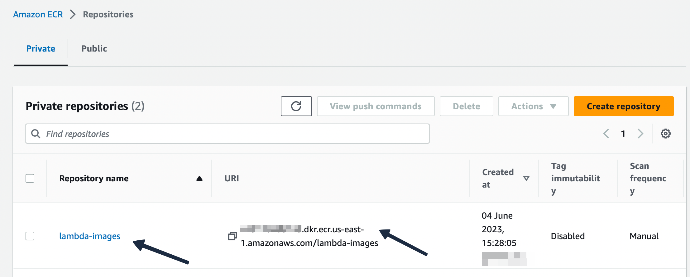

In the screenshots we can see that our container image is uploaded to the registry.

## AWS Lambda function  

AWS Lambda allows us to use our container image from ECR to use as source. We need to give the image URI(can be found in ECR console). Below screenshot shows the step to point at the container image and create a function.
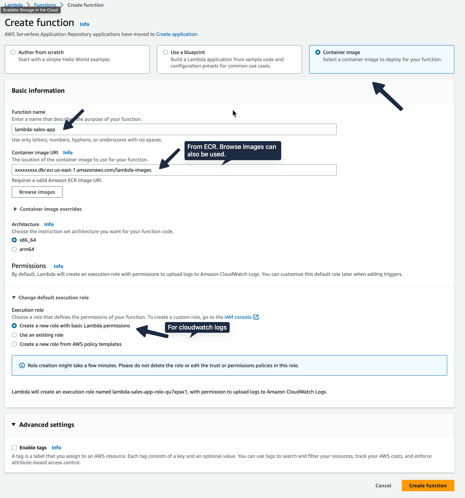

In cloud environment, security is a massive risk. So AWS insists on policies everywhere. Policy allows only revelant people access. Below policy screenshot shows us giving permission to Cloudwatch to create log groups, put log events whenever the Lambda function is invoked. You can goto "Monitor" tab and browse through the logs.

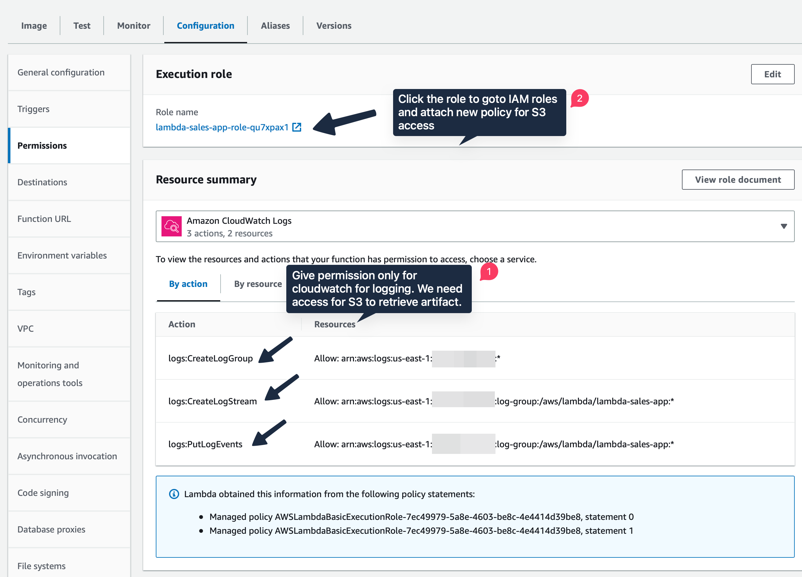

### Policy for S3 access
Since our artifact after ML training is stored in S3 bucket, we need to give the Lambda function permission to access it. For that click on the role `lambda-sales-app-role-qu7xpax1` under `Execution role`. It will direct to the IAM console. Here click "Add Permission" - "Create Inline Policy" - "JSON" tab and paste the following JSON data:

```{.json}
{
    "Statement": [
        {
            "Action": [
                "s3:Get*",
                "s3:List*"
            ],
            "Effect": "Allow",
            "Resource": [
                "arn:aws:s3:::mlops-project-sales-forecast-bucket",
                "arn:aws:s3:::mlops-project-sales-forecast-bucket/*"
            ]
        }
    ],
    "Version": "2012-10-17"
}
```
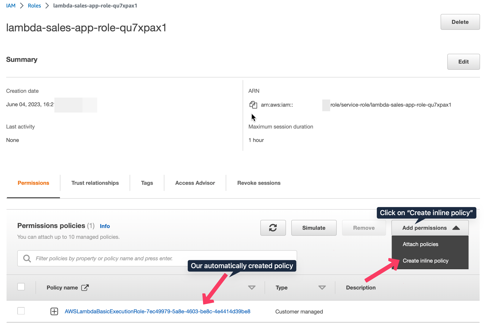
`mlops-project-sales-forecast-bucket` is the name of the S3 bucket where the artifacts are stored. I give restricted permission to the Lambda function. Quite often we see `resource` will be given `*` which can led to problems and security threats in the future. Review it.
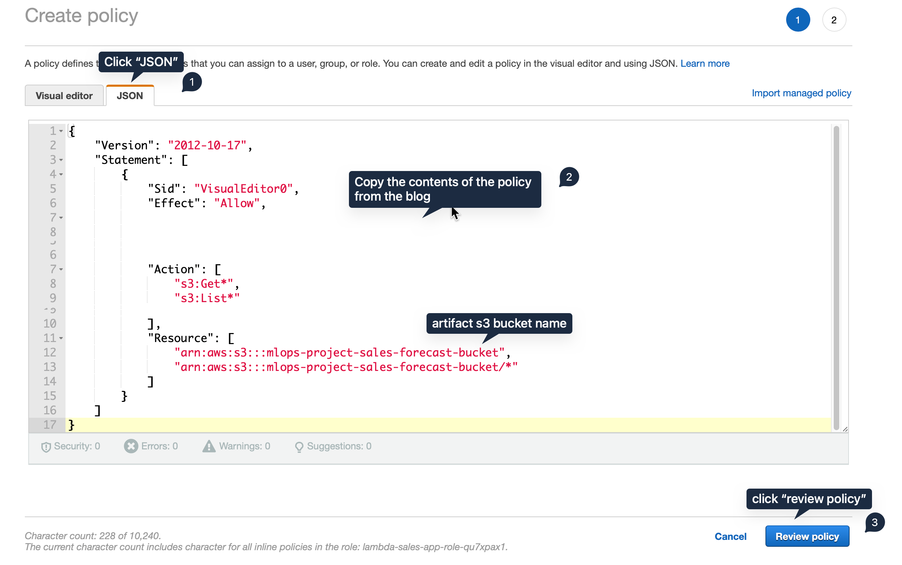

Next, create a unique name for it and click create policy.
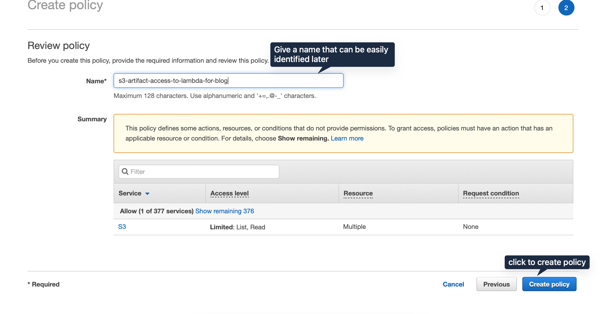

In the overview policy console page, we can see that there are two policies attached. That means the lambda function has permission to download from that specified S3 bucket.
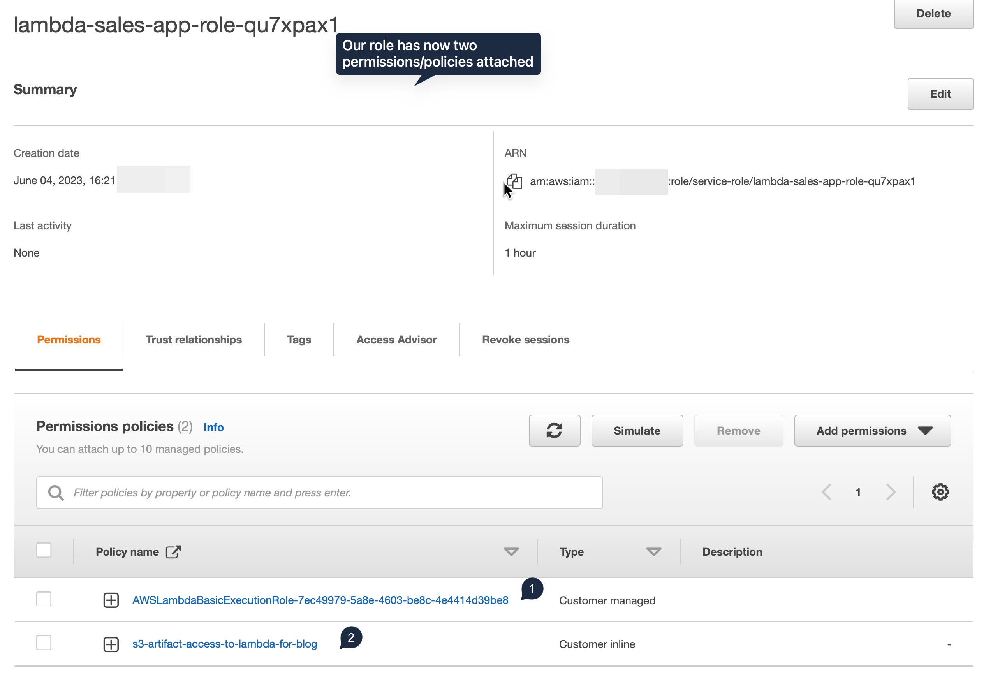

### Environment Variables and Configuration
In the `configuration` tab, `environment variable` section add in `RUN_ID` and `S3_BUCKET_NAME`.
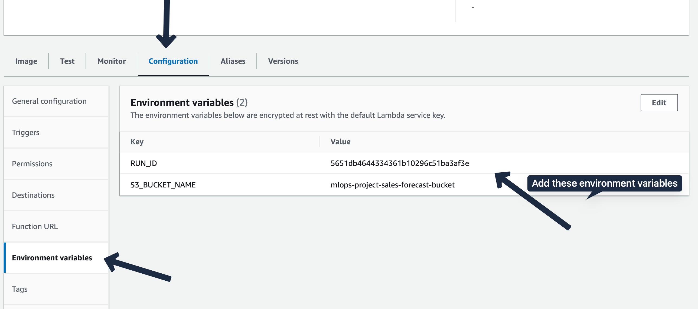
Next change the `Max Memory` and `Timeout` values in the `General Configuration` section.
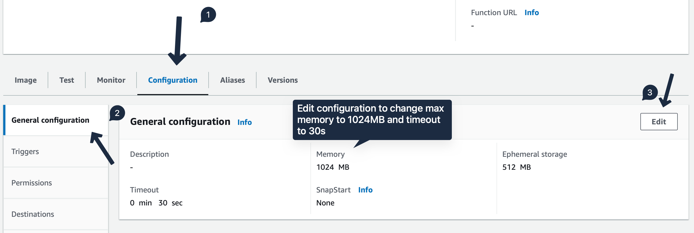

### Testing it at Lambda console
In the `Test` tab, we create a test event and give our sample JSON input.
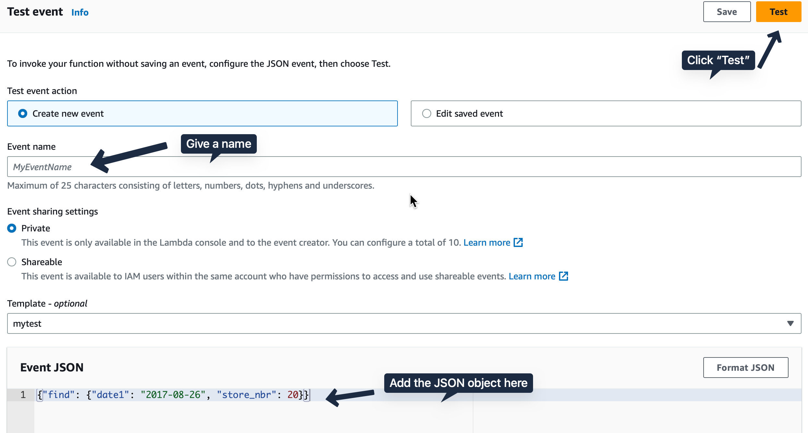
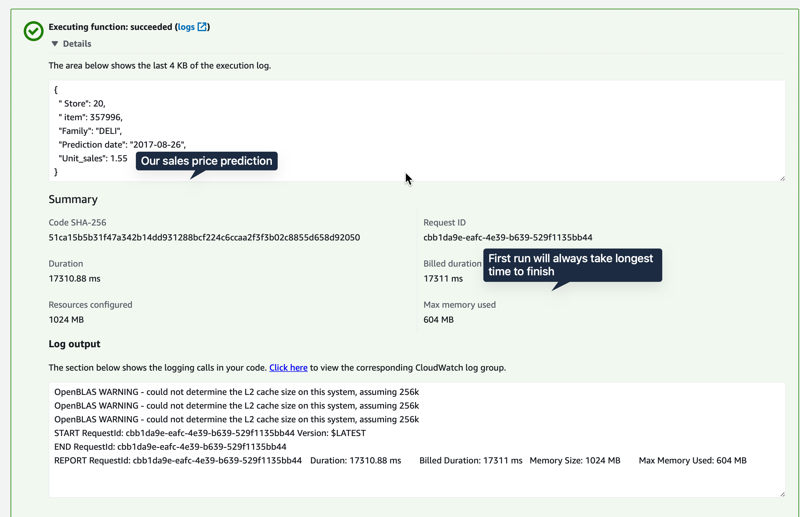
```{.json}
{"find": {"date1": "2017-08-26", "store_nbr": 20}}
```
If you get a successful execution as in the screenshot, it means the pipeline works and the attached policies are correct. Most time it is the policies that cause annoying issues.

## API Gateway

### Rest API with an endpoint
We will create a `REST API` with an endpoint of `predict-sales` using `POST` method.
Goto API Gateway console -> Create API -> Rest API -> Click Build.
Here give an appropriate name and description. 
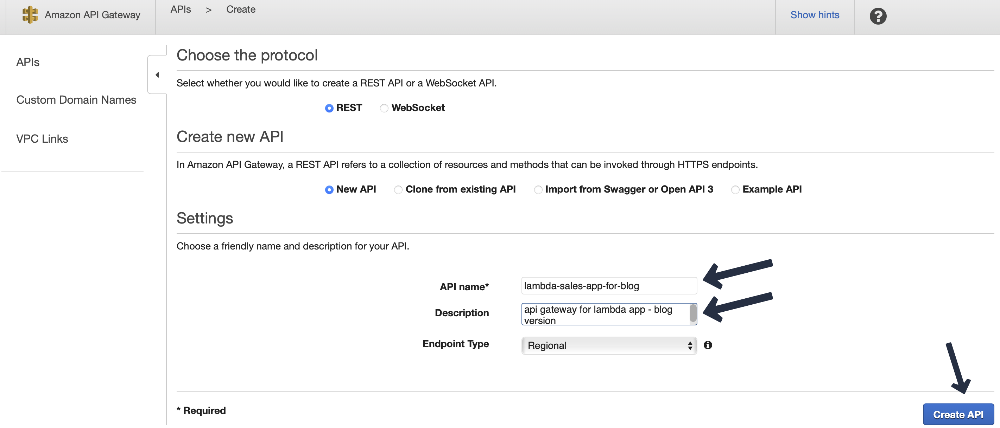

Then we create our endpoint `predict-sales` as a resource and `POST` method under it. While creating the `POST` method, we point it to our previously created Lambda function `lambda-sales-app`.
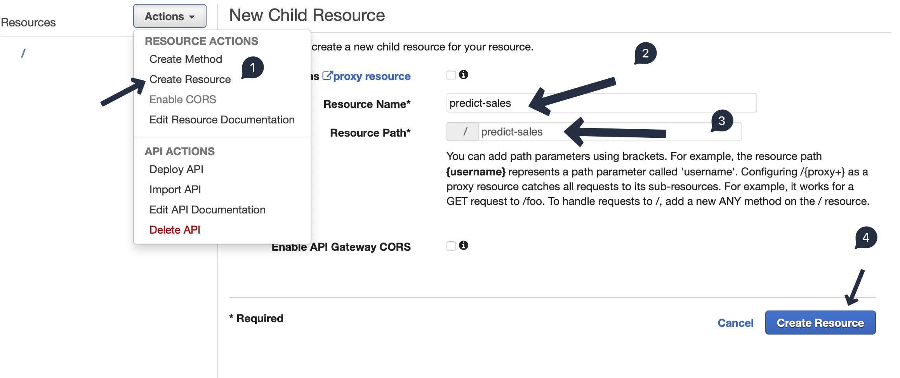
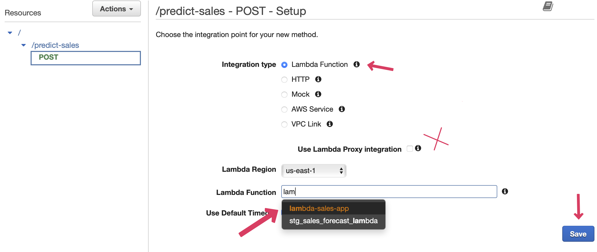
There will be a pop up window with `ARN` address. This address will be same as Lambda function. You can verify it by going to the Lambda console.


### Testing
Before deploying the API we can test. Press the `Test` button, give the sample JSON input in the `body` section and expect an output similar to Lambda test.
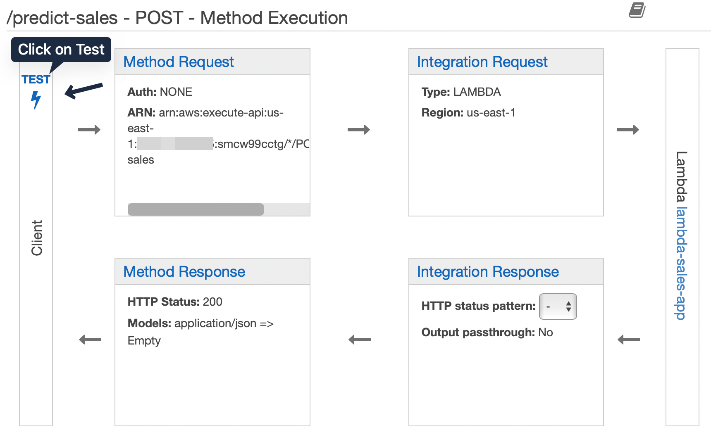
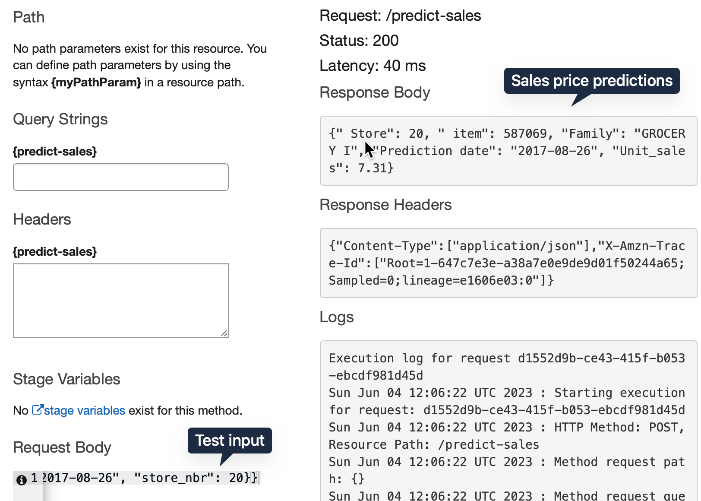

Now our API is ready for deployment.
### Deployment
From the actions menu choose "Deploy API". Choose "New Stage", give a name and then deploy.
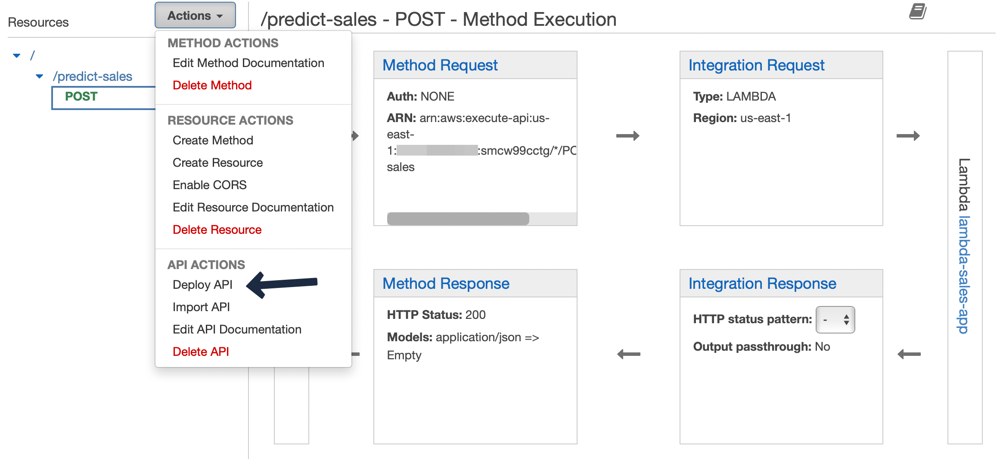
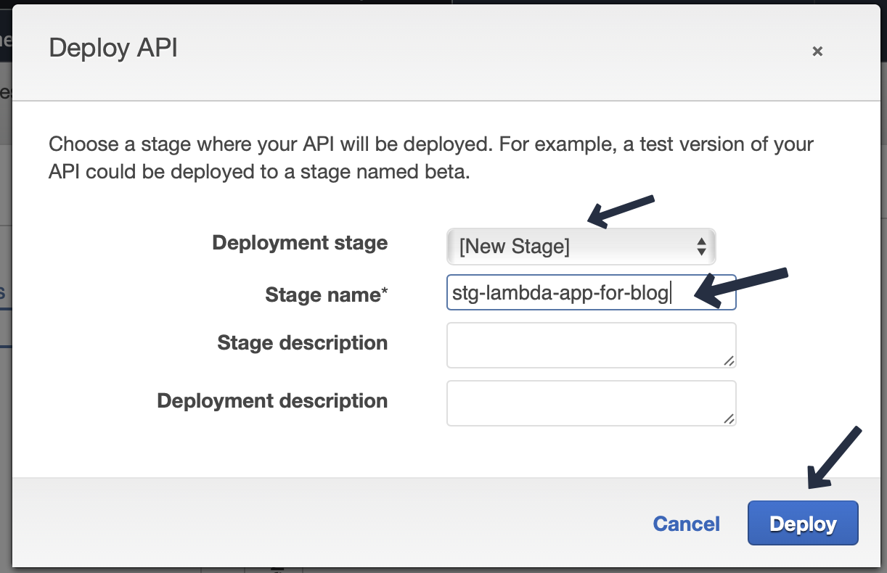
We will get an `invoke` url. However, we need to append our endpoint `predict-sales` to complete it. So it will look something like `https://xxxxxxxx.execute-api.us-east-1.amazonaws.com/stg-lambda-app-for-blog/predict-sales`


## DynamoDB add policy

Add this policy to the previously created role to give lambda access to write to DynamoDB.


```{.json}
{
    "Version": "2012-10-17",
    "Statement": [
        {
            "Effect": "Allow",
            "Action": [
                "dynamodb:BatchGetItem",
                "dynamodb:GetItem",
                "dynamodb:Query",
                "dynamodb:Scan",
                "dynamodb:BatchWriteItem",
                "dynamodb:PutItem",
                "dynamodb:UpdateItem"
            ],
            "Resource": "arn:aws:dynamodb:us-east-1:4xxxxxxxx:table/sales_preds_for_blog"
        },
        {
            "Effect": "Allow",
            "Action": [
                "logs:CreateLogStream",
                "logs:PutLogEvents"
            ],
            "Resource": "arn:aws:dynamodb:us-east-1:4xxxxxxxx:table/sales_preds_for_blog"
        },
        {
            "Effect": "Allow",
            "Action": "logs:CreateLogGroup",
            "Resource": "arn:aws:dynamodb:us-east-1:4xxxxxxxx:table/sales_preds_for_blog"
        }
    ]
}
```